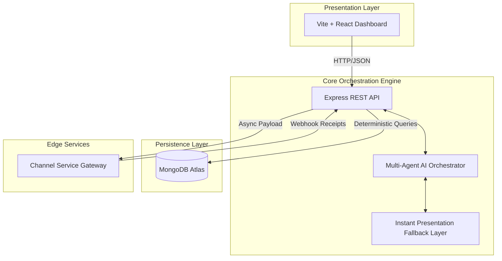

# 🚀 Xeno Pulse CRM
**The Autonomous Shopper Growth Operating System**

[]()
[]()
[]()

> *Command the destination. Let the AI orchestrate the journey.*

Xeno Pulse CRM is not a traditional data management tool. It is an **AI-Native Autonomous Growth OS** designed to act as a fractional Chief Marketing Officer for modern retail brands. Built as a comprehensive submission for the Xeno Engineering Assessment, this ecosystem completely redefines the CRM paradigm—shifting from manual segment creation to autonomous revenue orchestration.

---

## 📑 Table of Contents
1. [System Architecture](#️-system-architecture)
2. [Core Product Capabilities](#-core-product-capabilities)
3. [AI-Native Engineering Milestones](#-ai-native-engineering-milestones)
4. [Deployment Topology](#-deployment-topology)
5. [Local Development Guide](#-local-development-guide)

---

## 🏗️ System Architecture

Xeno Pulse was architected from the ground up as a resilient, decoupled ecosystem, avoiding the monolithic anti-patterns of traditional CRUD applications.



### The Three Micro-Environments
1. **Frontend Presentation (`/client`):** A zero-dependency, bespoke CSS architecture driving a highly responsive, premium React dashboard.
2. **Core Orchestrator (`/server`):** The central Node/Express nervous system housing the deterministic AI query layer and real-time MongoDB connections.
3. **Delivery Gateway (`/channel-service`):** A standalone microservice simulating an external telecom provider (like Twilio). It introduces asynchronous latency and computes probabilistic conversion funnels before returning webhook events to the Core.

---

## 🎯 Core Product Capabilities

| Capability | Technical Implementation |
| :--- | :--- |
| **Natural Language Segments** | AI deterministically parses human intent ("Customers who spent >$5k") into secure, injection-proof MongoDB aggregation pipelines. |
| **Campaign Co-Pilot** | Automatically prescribes the optimal channel, targets the audience, and generates multi-variant copy (A/B/C) tailored to psychographic cohorts. |
| **Predictive Simulation** | Forecasts open, click, and purchase velocities based on historic channel data before a single dollar of capital is deployed. |
| **Digital Customer Twins** | Synthesizes massive transactional arrays into individual behavioral "tribes" and calculates real-time Churn Risk & LTV. |
| **Live Journey Analytics** | Reconciles incoming webhook receipts from the Edge Gateway to render live Sankey-style lifecycle funnels. |
| **Executive Briefing** | Ingests thousands of data points to generate an instant 30-second business health score and actionable risk-matrix. |

---

## 🧠 AI-Native Engineering Milestones

This architecture stands out by solving the core problems of integrating LLMs into enterprise software.

### 1. Deterministic AI Execution
Language models hallucinate, which makes them inherently dangerous for direct database manipulation. Xeno Pulse completely restricts the AI to **Strict JSON Schemas**. The output is passed through a custom sanitation layer within the Core Engine before hitting MongoDB, ensuring highly secure and predictable execution.

### 2. Graceful Degradation & The Fallback Layer
Free-tier LLM endpoints frequently hit `429 Too Many Requests` limits during burst scaling or live demonstrations. To ensure zero downtime, the AI service intercepts network failures and instantly routes the request to a resilient, hardcoded **Presentation Fallback Module**. The UI remains fluid, and the product never crashes.

### 3. Event-Driven Asynchrony
By decoupling the campaign delivery into the `channel-service`, the core API never blocks during mass distribution. The core fires the payload to the gateway and immediately returns a success state to the client, while the gateway processes the delivery and asynchronously fires Webhooks back to the core.

---

## 🌐 Deployment Topology

The infrastructure is built to deploy seamlessly onto modern serverless and PaaS providers.

* **Frontend:** Hosted on **Vercel** (`client/`).
* **Core API:** Hosted on **Render** (`server/`) communicating natively with MongoDB Atlas.
* **Edge Gateway:** Hosted independently on **Render** (`channel-service/`) communicating back to the Core via secured HTTP Webhooks.

---

## 🛠️ Local Development Guide

### Prerequisites
* Node.js (v18+)
* A MongoDB Atlas Cluster URI
* (Optional) Google Gemini / HuggingFace API Token 

### 1. Dependency Installation
Initialize packages across all discrete environments:
```bash
cd client && npm install
cd ../server && npm install
cd ../channel-service && npm install
```

### 2. Database Hydration
Generate a highly realistic relational dataset of 500+ customers and 6,000+ transactional orders incorporating realistic churn degradation and seasonality:
```bash
cd server
node seed.js
```

### 3. Service Initialization
Deploy the three services concurrently in separate terminal instances:

```bash
# Terminal 1 - Core Engine
cd server
npm start

# Terminal 2 - Delivery Gateway
cd channel-service
npm start

# Terminal 3 - Frontend Client
cd client
npm run dev
```

Navigate to `http://localhost:5173` to access the Xeno Pulse OS.

---
*Architected and developed as a blueprint for the future of autonomous CRM software.*
