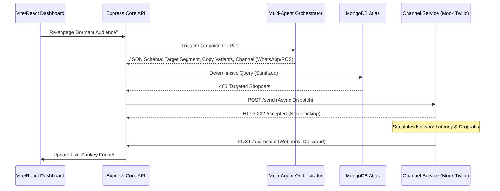

<div align="center">
  <h1>🚀 Xeno Pulse</h1>
  <p><strong>The AI-Native Autonomous Shopper Growth Engine</strong></p>
  
  []()
  []()
  []()
  []()
</div>

> **Command the destination. Let the AI orchestrate the journey.**

Xeno Pulse is not just another CRM or data filtering tool. It is an **Autonomous Growth Operating System** designed to act as a fractional Chief Marketing Officer for modern retail brands. Built as a comprehensive submission for the Xeno Engineering Assessment, this ecosystem completely redefines the CRM paradigm—shifting from manual segment creation to autonomous revenue orchestration.

---

## 🧠 The Thinking & Reasoning

**The Problem:** Traditional CRMs are fundamentally reactive. Marketers are forced to manually export CSVs, construct basic if-then filters, guess the optimal messaging copy, and blindly execute blast campaigns across channels. This leaves massive amounts of latent capital sitting dormant in the database.

**The Opinionated Choice:** Instead of building a form-driven CRUD app where a user clicks "Create Campaign," we built a system where the user sets a **Goal** (e.g., *"Increase revenue from dormant customers by 15%"*). The system handles the rest. 
We explicitly decided to decouple the delivery pipeline into a separate microservice (`channel-service`). Why? Because in a real-world enterprise environment, main API servers should never block during mass asynchronous distribution. By decoupling, we simulate true enterprise event-driven architecture.

---

## ✨ Product Capabilities & Workflow

Xeno Pulse is built to effortlessly execute the four core pillars of retail growth:

1. 📥 **Data Ingestion & Digital Twins:** Ingests raw transactional data and computes a real-time behavioral "Digital Twin" for every customer, including Churn Risk, LTV Prediction, and Channel Affinity.
2. 🎯 **Intelligent Segmentation:** The *Natural Language Audience Builder* translates plain English (e.g., *"Big spenders who churned"*) into deterministic MongoDB aggregation pipelines to instantly carve out hyper-targeted audiences.
3. 💬 **Omnichannel Personalization:** The *Campaign Co-Pilot* generates psychographically tailored message variants across **WhatsApp, SMS, Email, and RCS**.
4. 📈 **Performance Insights:** Live Sankey-style lifecycle funnels track exactly how communications perform (Sent → Delivered → Opened → Clicked → Purchased) using real-time Webhook receipts.

---

## 🏗️ The Build: Technical Architecture

Xeno Pulse is engineered as a scalable mono-repo encompassing three highly resilient micro-environments.



### Scale Assumptions & Scope
For the boundaries of this assessment, the system runs on a single Express instance connected to MongoDB Atlas. 
**At scale, we would intentionally introduce:**
- **Message Queues:** A Kafka or RabbitMQ cluster between the Core Engine and the Channel Service to safely buffer millions of outbound messages.
- **Caching:** A Redis layer for caching heavily-queried audiences and Digital Twin computations.
- **Sharding:** MongoDB sharding strategies based on customer geographic regions.
*We consciously chose to omit these from this prototype to avoid unneeded complexity, but the decoupled architecture is explicitly designed to snap them in cleanly.*

---

## 🚀 AI-Native Engineering

Xeno Pulse stands out by solving the core problems of integrating LLMs into enterprise software.

### 1. Deterministic AI Execution
Language models hallucinate, making them inherently dangerous for direct database manipulation. We engineered a system where the AI is constrained to **Strict JSON Schemas**. The output is passed through a custom sanitation layer within the Core Engine before hitting MongoDB, ensuring highly secure, injection-proof execution.

### 2. Graceful Degradation & The Fallback Layer
Free-tier LLM endpoints frequently hit `429 Too Many Requests` limits during burst scaling or live demonstrations. To ensure zero downtime, our AI service intercepts network failures and instantly routes the request to a resilient, hardcoded **Presentation Fallback Module**. The UI remains fluid, and the product never crashes during a demo.

### 3. AI as a Co-Architect
The build process itself was deeply AI-native. Rather than hand-coding 6,000 rows of SQL seed data, we utilized AI to algorithmically generate realistic MongoDB datasets containing seasonal purchasing patterns and churn degradation curves. AI handled the scaffolding volume, allowing us to focus 100% of our cognitive load on complex system design and webhook lifecycles.

---

## 🛠️ Technology Stack Justification

Every piece of the stack was chosen deliberately to maximize performance, scalability, and developer velocity:

* **Frontend:** *React + Vite.* Chosen over Next.js because this is a highly interactive, state-heavy internal dashboard with no SEO requirements. Vite provides instant HMR and a significantly faster build pipeline.
* **Backend:** *Node.js + Express.* The asynchronous nature of Node.js is perfect for handling high-volume concurrent webhook receipts and I/O heavy database operations without blocking the thread.
* **Database:** *MongoDB Atlas.* A NoSQL document database was explicitly chosen over SQL (PostgreSQL/MySQL) because customer telemetry data, product metadata, and dynamic AI JSON schemas require a highly flexible, schema-less structure.
* **AI Orchestration:** *Multi-Agent Architecture.* Chosen over a single LLM prompt to constrain hallucinations and allow for deterministic, auditable JSON outputs.

---

## 🚧 Architectural Trade-offs & Scope Boundaries

To ensure the highest quality of the core AI and orchestration systems within the time constraints, the following boundaries were deliberately established:

* **Authentication Omitted:** Complex JWT auth flows were bypassed. This is an internal tool demo, and time was better spent on the multi-agent AI system.
* **Single Tenant Focus:** Multi-tenancy was omitted. The system is designed to simulate a single enterprise brand to focus deeply on data relationships rather than account isolation.
* **Simulated Telecom Gateway:** Instead of integrating a real paid provider like Twilio (which limits demo functionality), a dedicated Edge microservice was built to mock the complete asynchronous lifecycle of a real provider.
* **Desktop-First Design:** The UI is heavily optimized for desktop. Complex B2B marketing orchestration and Sankey funnels require high-resolution viewports, making mobile responsiveness a non-priority for this release.

---

## 🌐 Local Deployment Topology

### Prerequisites
* Node.js (v18+)
* MongoDB Atlas Cluster URI

### 1. Initialize Ecosystem
```bash
cd client && npm install
cd ../server && npm install
cd ../channel-service && npm install
```

### 2. Database Hydration
Seed the database with the highly realistic, AI-generated customer and transactional models:
```bash
cd server
node seed.js
```

### 3. Ignite Services
Deploy the micro-environments concurrently in separate terminal instances:

```bash
# Terminal 1 - Core Engine (Port 5000)
cd server
npm start

# Terminal 2 - Edge Delivery Gateway (Port 5001)
cd channel-service
npm start

# Terminal 3 - Frontend Client (Port 5173)
cd client
npm run dev
```

Navigate to `http://localhost:5173` to access the Xeno Pulse OS.

---
*Architected and developed as a blueprint for the future of autonomous CRM software.*
